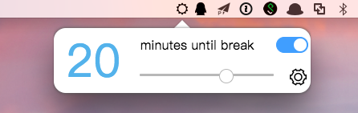
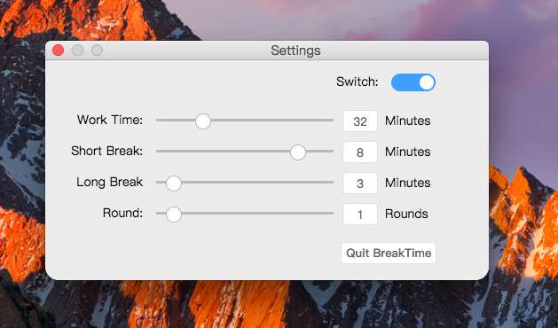
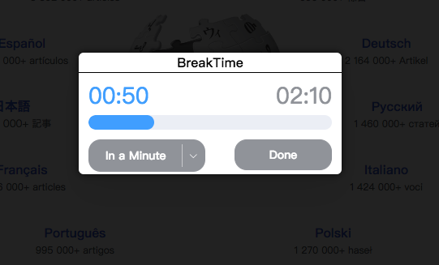

# breaktime

>An electron project that is designed to help you remember to take breaks away from your
computer. It never forgets a break, running in your dock and menu bar.


## Quick Access


BreakTime gives you quick access to the things you need to manage your breaks.
With a glance up to the status bar. See how much time you have left until
youbreak. Use the BreakTime popup to reschedule breaks with a drag of mouse.

Or switftly disable BreakTime so that you can watch a movie without the interruption.

## Customized Settings



## Break


It will slowly darkens your screen when you should have a break.
It's a little things and very help.


#### Build Setup

``` bash
# install dependencies
npm install

# serve with hot reload at localhost:9080
npm run dev

# build electron application for production
npm run build


```

---


changelog:

* verson1.0 用的SPA, 三个页面共用一个window，vuex 来控制三个页面状态，通过EventBus进行页面间消息传递。
 * 每个页面展示时window的大小样式都不一样，所以经常会根据当前页面类型来改变window的size，transparent 在render process 里改变window 属性不太友好

* version2.0 每个页面一个独立window，单独的render process进行渲染
	* 每个页面单独process，这样vuex 就没办法数据共享，考虑过用 electron 的global object来存储，想了下不够友好
	* 索性只留一个主页面mainWindow保留数据，其余页面的状态和数据都被main 来控制，mainWindow 通过消息控制企业两个页面
	* 数据持久化不自己造轮子localstore，用开源的electron-store来存储，本质也是读写json文件存储